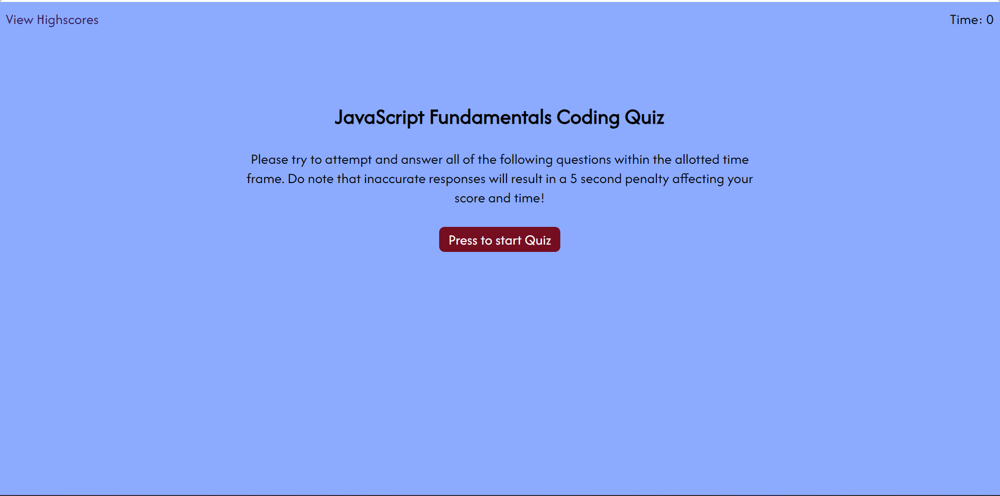

# Challenge 04 - Web API Code Quiz

## Description

In this task I was challenged to create a quiz with the main priority being JavaScript. My quiz was about the fundamentals of JavaScript.

You can see the JavaScript at work when you go through the questions and getting actual feedback from the browser. For e.g, when getting a question wright or wrong there is a sound that is played depending on your answer.

## Usage

You can view the page through this link ....

## Preview 

## Credits

Borrowed and modified existing code

## License

This project is licensed under the [MIT License](./LICENSE).